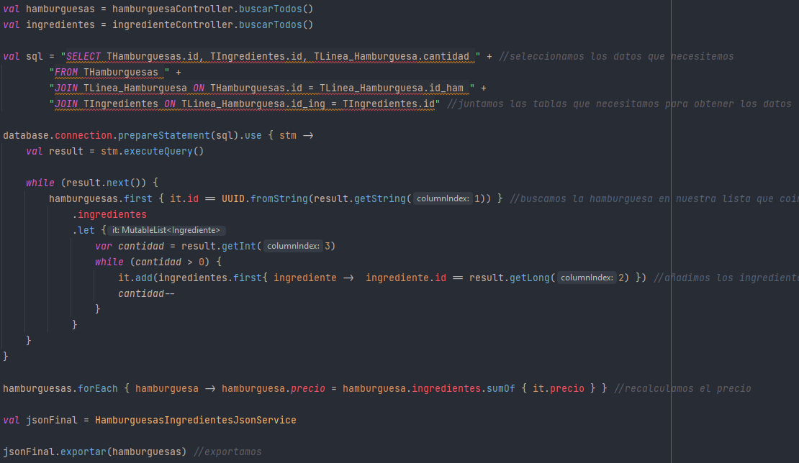
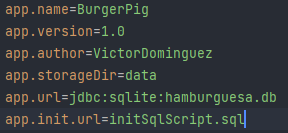
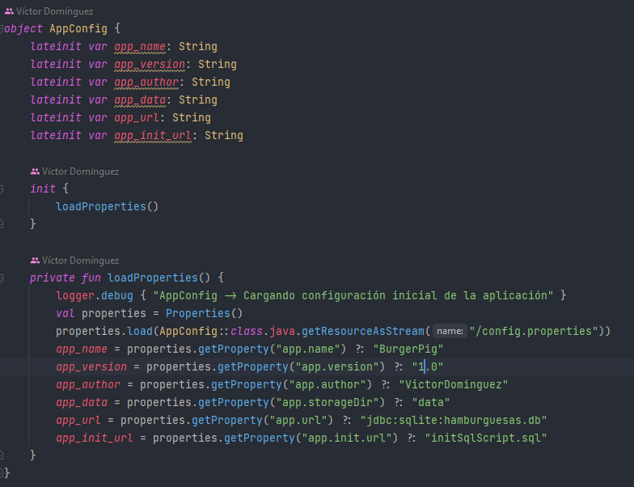
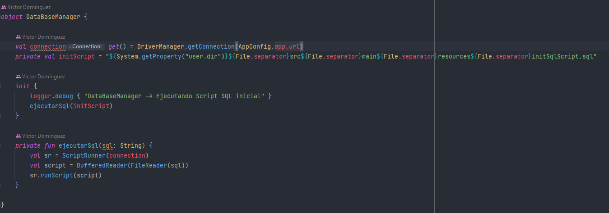
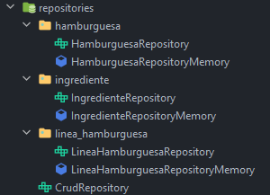
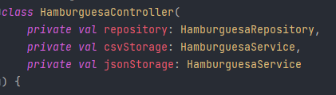

## Planteamiento

Creamos una tabla intermedia llamada Linea_Hamburguesa en la que como clave foránea tendremos el ID de la hamburguesa y el ID del ingrediente, junto a la cantidad de dicho ingrediente.
Asignamos a cada hamburguesa una lista de ingredientes y un precio que será calculado a partir de la lista de ingredientes.
Exportamos los datos a un fichero JSON usando modelos DTO.\

## Archivo "config.properties"
En este archivo configuramos las variables del proyecto\

## AppConfig
Aqui cargamos la configuración de la aplicación\

## Base de datos
Generamos la conexión a la base de datos y ejecutamos el Sript SQL inicial\

Tendremos tres tablas. Una para las hamburguesas, otra para los ingredientes y una tabla intermedia para relacionar cada hamburguesa con sus ingredientes.\
\

## Repositorios
En los repositorios se implementan las funciones propias del repositorio CRUD (interfaz CrudRepository). Tenemos un repositorio para gestionar cada tabla de la base de datos.
A los repositorios les inyectamos la base de datos para poder hacer las consultas.\
\

## Controladores
En los controladores he usado Results para controlar las excepciones y se gestiona la validación de los elementos que resgistramos en la base de datos.
Le inyectamos el repositorio y dos servicios de ficheros de lectura o exportación.\
\
