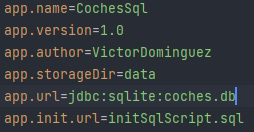
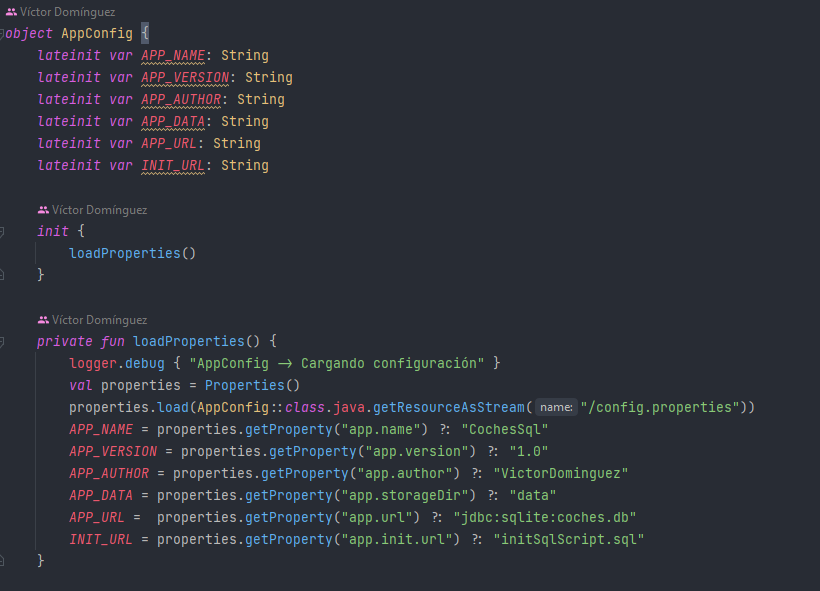
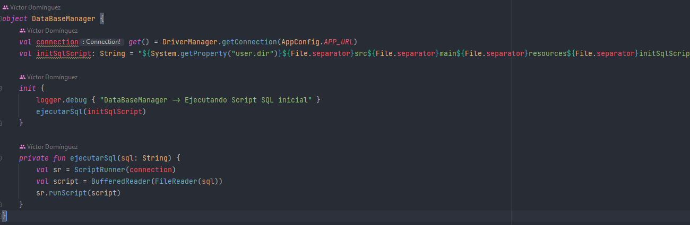
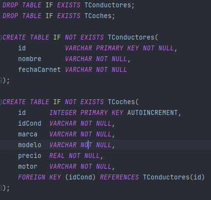
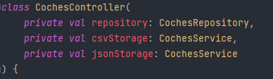

## Planteamiento

Dado el caso de que un conductor puede tener varios coches y un coche puede pertenecer a un solo conductor, es más
viable asignarle a cada coche el ID de su conductor como clave foránea.

## Archivo "config.properties"
En este archivo configuramos las variables del proyecto\
\

## AppConfig
Cargamos la configuración de la aplicación\
\

## Base de datos
Nos conectamos a la base de datos y ejecutamos el Sript SQL inicial\
\

Vamos a tener dos tablas en nuestra base de datos. Una para los coches y otra para los conductores.\
\

## Repositorios
Tendremos un repositorio para los coches y otro para los conductores. Las dos implementan la interfaz CrudRepository
que contiene las consultas a la base de datos.\
\

## Controladores
Igual que los repositorios, tendremos uno para los coches y otro para los conductores.
En el controlador nos encargamos de las excepciones usando Results y se validan los objetos que entran a las tablas de la base de datos.\
\
